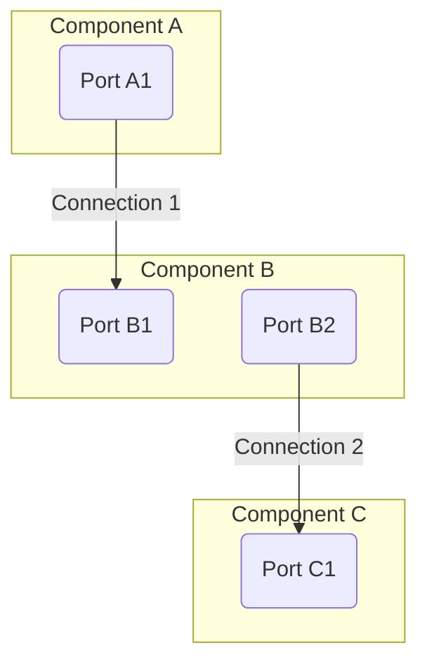
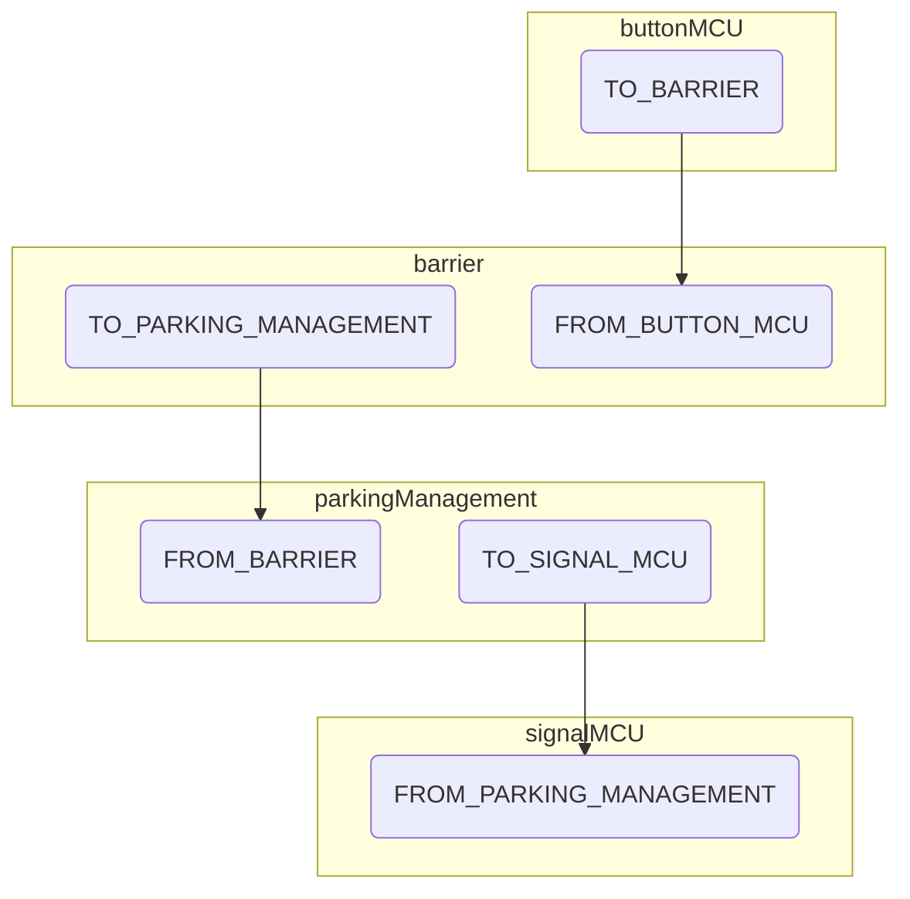
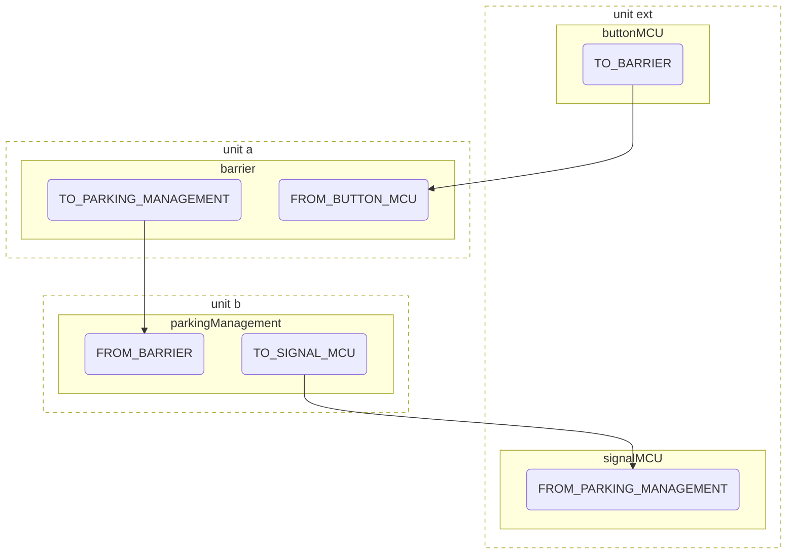

## SORRIR Framework

This project contains the execution framework developed in the [SORRIR](https://sorrir.io) project. SORRIR aims at supporting the development of resilient IoT systems.

[[_TOC_]]

##  Installation 

If this is your first TypeScript project, you may need to [install nodejs](https://nodejs.
org/en/download/package-manager/) and an IDE of your choice, e.g., [WebStorm](https://www.jetbrains.com/de-de/webstorm/), [VSCode](https://code.visualstudio.com/), or [VSCodium](https://vscodium.com/) (same as VSCode but without all the Microsoft tracking). 

To add the SORRIR framework to your application, run `npm install @sorrir/framework` from the root of your 
Typescript application.

## SORRIR Framework Overview

In the following section, we will give an overview about the inner workings of the Framework, disregarding implementation details.

### Components

From the top level view, our application consists of interconnected components. Components are the building blocks that make it possible to implement the application's logic.

The internal behavior of a component is defined by a state machine. Each component has a set of *states*, *ports* and *transitions*. Incoming *events* through specific ports can raise a transition from one state to another. 

### Ports & Connections

To communicate - or to be more precise, send events from one component to another - ports of components can be connected with *connections*. Connections logically describe to which target port a source port's events are send to.


Ports are either in our out ports, but can be part of multiple connections. Connections are unidirectional and have exactly one source and one target port.

### Events & Transitions

Events are instruction to other components to transition from on state to another. Events can be raised for multiple reasons, for instance as a result of transitions following events from other components, or from an external source like a sensor. Events have certain types, tied to the ports they have been sent through.

Transitions define how a component is to behave after receving certain events. For an event to trigger a certain transition, for requirements have to be met:

- Event needs to be the correct type
- Event needs to be the correct eventClass
- Event was received on the correct port
- Receiving component is in the correct state

If all requirements are fulfilled, the component executes the behaviour defined in the transition and consequently, for instance, transitions from one state to another or raises follow-up events.

Depending on the purpose of the event, there are four different event classes. `oneway` events are 'fire-and-forget', while `request` events indicate that the components awaits an answer, eiher in form of a `resolve` event (on success) or an `error` event (on error).

## Example implementation: Smart Parking Garage

In the following section, we will explain the basics on how to implement your first testbed according to a example, the *Smart Parking Garage*.

Here you can see the structure of the example including components, ports and connections between ports:



These are the components that need to be implemented. We start building our testbed by specifying the `barrier` component step-by-step followed by specifying a `parkingManagement` component. Furthermore, we explain how to integrate MQTT I/O components.

### Components

To create a new component, we have to describe its states, the external events it can handle, the ports through which it can be connected to other components, its internal state, and a state machine to describe its behavior.

#### States

`barrier` has two states `IDLE` and `CAR_ENTRY`. Define the state of a component within its `*.ts` file – in this case `Barrier.ts`.

```ts
enum BarrierStates {
    IDLE = "IDLE",
    CAR_ENTRY = "CAR_ENTRY"
}
```

#### Ports

Since ports are used to connect a component to another component, it is a good naming pattern to start the name of port with its direction followed by the target or target group. Events can be sent and received only to components that are connected to a component.

> In the current version of the SORRIR framework prototype a port's direction is just a naming convention. It is possible to send an event through port `FROM_MY_COMPONENT` whereas its name would indicate the other way round. In a future version, we will ensure a correct behavior within the framework.

`barrier` is connected to `barrierController` via port `FROM_BARRIER_CONTROLLER` and to `parkingManagement` via port `TO_PARKING_MANAGEMENT`. You have to define the ports of a controller as an enum:

```ts
export enum BarrierPorts {
    TO_PARKING_MANAGEMENT = "TO_PARKING_MANAGEMENT",
    FROM_BARRIER_CONTROLLER = "FROM_BARRIER_CONTROLLER"
}
```

#### Events

Since events are sent across various components of your application, their types should be defined in a central file `events.ts`. Event types must be defined as an *enum*:

```ts
export enum EventTypesIntern {
  CAR_IN = "CAR_IN",
  CAR_OUT = "CAR_OUT",
}

export enum EventTypesExtern {
  BUTTON_UP_PRESSED = "BUTTON_UP_PRESSED",
  BUTTON_DOWN_PRESSED = "BUTTON_DOWN_PRESSED",
  LED_RED = "LED_RED",
  LED_GREEN = "LED_GREEN",
  DISPLAY = "DISPLAY",
}
```

In this example, we use a two enums for the whole application, one for incoming events, one for outgoing ones. If your application grows, you can think of splitting it into several more specific event enums.

The events that are passed from component to component or within a component are typed by the *EventTypes* you specified in your *enum*. This way a component can react depending on the type of the event it has received. In general, an *Event* looks like this:

```ts
export interface Event<EVENT_TYPE, PORT_TYPE> {
  // all event classes
  readonly eventClass: EventClass;
  readonly type: EVENT_TYPE; 
  readonly port?: PORT_TYPE | typeof Internal;
  readonly timestamp?: number;
  readonly id: UUID;

  // only oneway, request, resolve
  readonly param?: any;
  
  // only resolve, error
  readonly rc: number;
  readonly answerToRequestID: UUID;

  // only error
  readonly error: string;
  readonly layer: EventSourceApplicationLayer | EventSourceFrameworkLayer;
}
```

- `type` is the aforementioned event type, for instance `EventTypesIntern.CAR_IN`
- `eventClass` specifies the class of event that is being sent, so either `oneway`, `request`, `resolve` or `error`.
- `port` is the port the event is being sent through, e.g. `BarrierPorts.TO_PARKING_MANAGEMENT`. If you do not specify a `port`, the event is an internal event of your component and is not being forwarded to other components by the engine.
- `timestamp` (set by the engine) is a number representing an incrementing logical clock. A higher number means a newer event.
- `id` (set by the engine) is a unique identifier of the event in UUID v4 format.
- `param` contains a user-defined payload for the event.
- `rc` is a user-defined return code of the event.
- `answerToRequestID` is the UUID of the preceding `request` event.
- `error` is an error message.
- `layer` is the layer an error occured on.

In the following, for simplification purposes, all events that we use are `oneway` events.

#### Internal State

A component can also have an internal state or data state that is passed from step to step. It can include any entry required for a component, however all of them should be *readonly*. After every transition, the internal state is rebuilt, external changes in between transition are not desired.

Define your internal state as a *type alias* containing all the attributes you need for your component:

```ts
type BarrierState = {
    lastAction : number;
}
```

The internal state of `barrier` holds a single attribute `lastAction: number`. We use this attribute to save the last timestamp a car passed the barrier (or a button was pressed) to ensure that this can happen only once per second.

#### Behavior

We describe the behavior of a component as a state machine. All the states, ports, event types, and the internal state defined before have to be passed as type parameters to the state machine:

```ts
const sm : StateMachine<BarrierStates, BarrierState, EventTypesIntern | EventTypesExtern, BarrierPorts> = {
    transitions: [...]
};
```

How, when, and under what conditions the state machine can switch from a state to another state is expressed by a transition. The interface of a transition looks as follows:

```ts
export interface Transition<
  DISCRETE_STATE,
  ABSTRACT_STATE,
  EVENT_TYPE,
  PORT_TYPE,
  EVENT extends Event<EVENT_TYPE, PORT_TYPE>
> {
  readonly sourceState: DISCRETE_STATE;
  readonly event?: [EventClass, EVENT_TYPE, PORT_TYPE?];
  readonly condition?: (myState: ABSTRACT_STATE, event?: EVENT) => boolean;
  readonly action?: Action<ABSTRACT_STATE, EVENT_TYPE, PORT_TYPE, EVENT>;
  readonly targetState: DISCRETE_STATE;
}
```

As we can see, we at least have to define a source and a target state. We can react to a specific event (otherwise the transition is activated automatically). We also can define a *guard* (condition) which ensures that the transition is activated only if a user defined condition is satisfied. Furthermore, we can define an action function that is executed if the transition is activated. Within this action function, we can update the internal state of the state machine or raise new events.

As you can see in the overview image of `barrier` above, if it is in state `IDLE` and receives one of the events `BUTTON_UP_PRESSED` or `BUTTON_DOWN_PRESSED` via port `FROM_BARRIER_CONTROLLER` it should send `CAR_IN` or `CAR_OUT` correspondingly to `parkingManagement` via port `TO_PARKING_MANAGEMENT` and switch to state `CAR_ENTRY`. Let's see how this works by creating a new transition inside the state machine:

```ts
...
transitions: [
	{
		sourceState: BarrierStates.IDLE,
	  targetState: BarrierStates.CAR_ENTRY
	}
]
...
```

This is the most basic transition. To activate it only on event `BUTTON_DOWN_PRESSED` you have to add:

```ts
{
	sourceState: BarrierStates.IDLE,
  targetState: BarrierStates.CAR_ENTRY,
  event: ["oneway", EventTypesExtern.BUTTON_UP_PRESSED, BarrierPorts.FROM_BUTTON_MCU]
}
```
Besides specifying the event that can activate that transition, we also have to define the port through which the event will be received. As you may noticed, you only can choose from events that were specified and passed as parameter to the state machine before.

To raise a new event, you can specify an action function:

```ts
{
	...
	action: (myState, raiseEvent, event) => {
		raiseEvent({ eventClass: "oneway", type: EventTypesIntern.CAR_OUT, port: BarrierPorts.TO_PARKING_MANAGEMENT});
		return { lastAction: Date.now() };
   }
	...
}
```
Our action function gets the internal state, `raiseEvent`, and the occurring event. `raiseEvent` is a callback function to raise a new event. It expects an `Event` as parameter. The interface of `Event` requires the attribute `type` and optional `port` and `payload` (see above). You can call `raiseEvent` as many times you need to.

The last line `{ lastAction: Date.now() }` updates the internal state by setting the current timestamp. We need this timestamp to simulate the time a car takes to pass the barrier. `barrier` should only switch back from `CAR_ENTRY` to `IDLE` after 1s. The corresponding transition looks as follows:

```ts
{
  sourceState: BarrierStates.CAR_ENTRY,
  targetState: BarrierStates.IDLE,
  condition: myState => myState.lastAction + 1000 <= Date.now(),
  action: myState => {
    // action is actually not required
    return myState;
  }
}
```
The condition ensures that this transition can be activated only if the last action happened at least 1000 ms back in time.

During the time `barrier` is in `CAR_ENTRY`, all incoming button events will not be processed but stored and processed when `barrier` is switched back to `IDLE`.

To complete the definition of `barrier` you have to define a transition for event `BUTTON_UP_PRESSED` correspondingly to `BUTTON_DOWN_PRESSED`.

#### AtomicComponent

Next, all things are grouped into a *AtomicComponent*. Unfortunately, the current version of the framework requires all elements of the ports enum to be listed manually and passed as argument to `createStatemachineComponent(...)`. The first array given is a list of ports and their specific event types. `sm` is the state machine you created before and `"barrier"` is the name of that component:

```ts
export const barrier: AtomicComponent<
  EventTypesIntern | EventTypesExtern,
  BarrierPorts
> = createStatemachineComponent(
  [
    {
      name: BarrierPorts.TO_PARKING_MANAGEMENT,
      eventTypes: Object.values(EventTypesIntern),
    },
    {
      name: BarrierPorts.FROM_BUTTON_MCU,
      eventTypes: Object.values(EventTypesExtern),
    },
  ],
  sm,
  "barrier"
);
```

#### Initial State

Finally, we have to describe the initial state of the component. In our case the start state is set to `IDLE`, the internal state to `lastAction: 0` and we did not put any prepared event in the event queue. 

```ts
export const barrierStartState: StateMachineState<BarrierStates, BarrierState, EventTypes, BarrierPorts> = {
    state: {
        fsm: BarrierStates.IDLE,
        my: {
            lastAction: 0
        }
    },
    events: [],
    tsType: "State"
};
```

If we want to dynamically set a start state without recompilation, e.g. with a configurable `lastAction` value, we can instead define a `StateGenerator` to create our state on runtime instead:

```ts
export const barrierStartStateGenerator: StateMachineStateGenerator<BarrierStates, BarrierState, EventTypes, BarrierPorts> = {
  tsType: "StateGenerator",
  argTypes: { lastAction: number } // allowed types are number, boolean or string
  generate: ({ lastAction }) => {
    return {
      state: {
            fsm: BarrierStates.IDLE,
            my: {
                lastAction: <number>lastAction
            }
        },
        events: [],
        tsType: "State"
    }
  }
};
```

#### Component parkingManagement

You can find `parkingManagement` inside `ParkingManagement.ts` of our examples repository. `parkingManagement` consist of the states `AVAILABLE` (there are free parking spaces in the parking garage) and `FULL` (no free parking spaces left). It is connected via port `FROM_BARRIER` to `barrier` and via port `TO_SIGNAL_CONTROLLER` to `signalController` I/O component.

On every transition this component sends three events to the `signalController`: *LED RED* on or off, *LED GREEN* on or off, and the remaining free parking spaces. Depending on the received car event from `barrier` the number of free parking spaces (stored in the internal state of `parkingManagement`) is in- or decreased. While there are free parking spaces left, `parkingManagement` stays in `AVAILABLE`. If there are no spaces left, it switches to `FULL`.

Regarding to the way MQTT works, we raise three single events for each of the hardware components we want to control:

```ts
...
{
  sourceState: ParkingManagementStates.AVAILABLE,
  targetState: ParkingManagementStates.FULL,
  event: ["oneway", EventTypesIntern.CAR_IN, ParkingManagementPorts.FROM_BARRIER],
  condition: (myState) => myState.freeParkingSpaces - 1 === 0,
  action: (myState, raiseEvent) => {
    const updatedFreeParkingSpaces = myState.freeParkingSpaces - 1;
    const pubPayloadRed: MQTTPubPayloadEventsEncoded = {
      type: EventTypesExtern.LED_RED,
      payload: { stringPayload: testbedStatusEncoder(true) },
    };
    const pubPayloadGreen: MQTTPubPayloadEventsEncoded = {
      type: EventTypesExtern.LED_GREEN,
      payload: { stringPayload: testbedStatusEncoder(false) },
    };
    const pubPayloadDisplay: MQTTPubPayloadEventsEncoded = {
      type: EventTypesExtern.DISPLAY,
      payload: {
        stringPayload: testbedSpacesEncoder(updatedFreeParkingSpaces),
      },
    };

    raiseEvent({
      eventClass: "oneway",
      type: pubPayloadRed,
      port: ParkingManagementPorts.TO_SIGNAL_MCU,
    });
    raiseEvent({
      eventClass: "oneway",
      type: pubPayloadGreen,
      port: ParkingManagementPorts.TO_SIGNAL_MCU,
    });
    raiseEvent({
      eventClass: "oneway",
      type: pubPayloadDisplay,
      port: ParkingManagementPorts.TO_SIGNAL_MCU,
    });

    return {
      freeParkingSpaces: updatedFreeParkingSpaces,
      totalParkingSpaces: myState.totalParkingSpaces,
    };
  },
},
```
There is a small but important difference to the events we raised from `barrier`. This time, the raised events have a payload.

```ts
raiseEvent({
  eventClass: "oneway",
  type: pubPayloadGreen,
  port: ParkingManagementPorts.TO_SIGNAL_MCU,
});
```

To enable a state machine to handle events with a payload, we have to specify an additional payload type at the state machine definition `MQTTPubPayloadEventsEncoded`:

```ts
const sm: StateMachine<
  ParkingManagementStates,
  ParkingManagementState,
  MQTTPubPayloadEventsEncoded | EventTypesIntern | EventTypesExtern,
  ParkingManagementPorts
> =
{ ... }
```

We can specify any arbitrary data type or interface as payload. In our case, the payload looks like this:

```ts
export interface MQTTPubPayloadEventsEncoded {
  type: EventTypesExtern;
  payload: {
    stringPayload?: string;
  };
}
```
The remaining things to do are similar to `barrier`.

In the next section, we describe how MQTT I/O components can be specified.

#### MQTT Components

We use the MQTT protocol to communicate with the sensor nodes. MQTT follows the publish/subscribe pattern and is a lightweight machine-to-machine protocol for the Internet of Things.

<!--There are two kinds of MQTT components which the SORRIR framework offers out-of-the-box. A *MQTTReceiveComponent* and a *MQTTSendComponent*. Both MQTT components of our testbed are declared in  `MQTTComponents.ts` and are described in the following.-->

Be aware that using MQTT requires a MQTT broker. You can run a broker at your own, for example [Mosquitto](https://mosquitto.org/), or use one that is public available, e.g., `mqtt://test.mosquitto.org`. Whatever you decide to do, you must add your MQTT credentials to your configuration.

Something to keep in mind: During the start of your application each MQTT component connects to the MQTT broker, which could take some time.

We have two MQTT components: `signalMCU` and `buttonMCU`, which are defined in `ext-components.ts`. Similarly to regular components, they require the an `enum` to contain their ports:

```ts
export enum signalMCUPort {
  FROM_PARKING_MANAGEMENT = "FROM_PARKING_MANAGEMENT",
}

export enum buttonMCUPort {
  TO_BARRIER = "TO_BARRIER",
}
```

However, while MQTT components appear as regular components to others, the differ in their inner workings. They have no explicitly specified behavior, instead they mask the real, physical component (e.g. a micro controller) and act as a proxy messages sent by the device. On every MQTT message the component receives, it calls a decode function. If your function returns an event, the component will send it through the specified port.

Since in other regards the MQTT components are stateless, we define a function to create an empty component:
```ts
function createEmptyComponent(
  name: string,
  port: buttonMCUPort | signalMCUPort
): AtomicComponent<EventTypesExtern, buttonMCUPort | signalMCUPort> {
  return {
    name: name,
    step: (state) => undefined,
    allSteps: (state) => [state],
    ports: [createPort(port, Object.values(EventTypesExtern))],
    tsType: "Component",
  };
}
```

and the create the components by calling

```ts
export const signalMCU = createEmptyComponent(
  "signalMCU",
  signalMCUPort.FROM_PARKING_MANAGEMENT
);
export const buttonMCU = createEmptyComponent(
  "buttonMCU",
  buttonMCUPort.TO_BARRIER
);
```

As mentioned, the MQTT-components are stateless, so their state is just a dummy:

```ts
export const compState: AbstractState<string, unknown, unknown> = {
  state: "dummy_state",
  events: [],
  tsType: "State",
};
```

<!-- you even do not need to create a start state by hand, instead, call `createMQTTReceiveComponentState(...)` with the following parameters:

* `name:string` the MQTT receiver will subscribe to a topic named like that. In our example, we set the topic to `sorrir/button-pressed`. Be careful: currently you have to ensure by hand that this topic is the same as you specified on the microcontroller.
* `brokerUrl: string` URL of your MQTT broker.
* `opts?: IClientOptions` is taken by the underlying MQTT library. In our case, we specify username, password, and clientId. For all possible attributes, we refer to the official [documentation of MQTT.js](https://github.com/mqttjs/MQTT.js#client).
* `decode? : (mqttPayload: string) => Event<E, P, D> | undefined` is the function you have to write to decode the MQTT payload into a corresponding event of your application. Microcontroller `buttonMcu` (the one with the buttons connected to) sends to the topic you defined either payload `BUTTON_UP_PRESSED` or `BUTTON_DOWN_PRESSED` regarding the pressed button. In consequence, the resulting decode function is:

```ts
const decode = (payload: string) => {
    if (payload === "BUTTON_UP_PRESSED" || payload === "BUTTON_DOWN_PRESSED") {
        return {port: barrierControllerPorts.TO_BARRIER, type: payload };
    }
}
```

The full call to create a MQTT receive component looks as follows:

```ts
const opts = { username: params.mqttUser, password: params.mqttPw};

export const barrierController = createMQTTReceiveComponent(mqttBarrierControllerName, barrierControllerPorts.TO_BARRIER);
export const barrierControllerState = createMQTTReceiveComponentState(mqttButtonTopic, params.mqttURL, {...opts, clientId: mqttBarrierControllerName}, decode);
```
-->

### Setup configuration

At this point, we have declared the components and defined their logic, but they, as building blocks, are yet to be connected to each other. To achieve that, we have to do two things:
- we need to expose them to the framework logic
- we need to specify instances of our components, as well as connections between their ports.

#### Registering components

First, we need to make components and their states visible. We start by creating an `index.ts` in the root of the folder the components are stored (in our case `./components`):

```ts
export * from "./barrier";
export * from "./ext-components";
export * from "./parking-management";
export * from "./event-types";
```

Then we add it to the `index.ts` of the root folder of the project:

```ts
export * from "./components";
```

If we have done everything correctly, our components will show up if we call `getSetupInfo()` from `reflect.ts`, e.g. from the command line with `node -e 'console.log(JSON.stringify(require(\"@sorrir/framework\").getSetupInfo(),undefined,2))'`:

```json
{
  "components": {
    "barrier": {
      "name": "barrier",
      "ports": [
        {
          "name": "TO_PARKING_MANAGEMENT",
          "eventTypes": [
            "CAR_IN",
            "CAR_OUT"
          ]
        },
        {
          "name": "FROM_BUTTON_MCU",
          "eventTypes": [
            "BUTTON_UP_PRESSED",
            "BUTTON_DOWN_PRESSED",
            "LED_RED",
            "LED_GREEN",
            "DISPLAY"
          ]
        }
      ],
      "tsType": "Component"
    },
    ...
  },
  "startStates": {
    "barrierStartState": {
      "state": {
        "fsm": "IDLE",
        "my": {
          "lastAction": 0
        }
      },
      "events": [],
      "tsType": "State"
    },
    ...
  }
}
```

#### Component instances and connections

After we have registered the components, we can now declare instances of each component and connect their ports with each other. This is done via `setup.json` in `./config`:

```json
{
    "componentInstances": {
        "barrier": [
            {
                "name": "barrier",
                "startState": "barrierStartState"
            }
        ],
        "signalMCU": [
            {
                "name": "signalMCU",
                "startState": "compState"
            }
        ],
        "buttonMCU": [
            {
                "name": "buttonMCU",
                "startState": "compState"
            }
        ],
        "parkingManagement": [
            {
                "name": "parkingManagement",
                "startState": "parkingManagementStartState"
            }
        ]
    },
    "connections": [
        {
            "sourceComponent": "barrier",
            "sourcePort": "TO_PARKING_MANAGEMENT",
            "targetComponent": "parkingManagement",
            "targetPort": "FROM_BARRIER"
        },
        {
            "sourceComponent": "buttonMCU",
            "sourcePort": "TO_BARRIER",
            "targetComponent": "barrier",
            "targetPort": "FROM_BUTTON_MCU"
        },
        {
            "sourceComponent": "parkingManagement",
            "sourcePort": "TO_SIGNAL_MCU",
            "targetComponent": "signalMCU",
            "targetPort": "FROM_PARKING_MANAGEMENT"
        }
    ]
}
```

In our case, we have one instance of every component. For example, one instance of type `barrier`, called `barrier` itself:

```json
"barrier": [
    {
        "name": "barrier",
        "startState": "barrierStartState"
    }
],
```
Our `barrier` instance has the start state `barrierStartState`. If we were to use a dynamic state instantiation instead via the previously defined `barrierStartStateGenerator, we could instead also do this:

```json
/* alternative with dynamic start state */
"barrier": [
    {
        "name": "barrier",
        "startStateGenerator": "barrierStartStateGenerator",
        "startStateArgs": {
          "lastAction": 0
        }
    }
],
```

### Application Configuration

Now that we have connected components to each other logically, we need to configure our application before being able to run it. This includes defining where components are to be executed, as well as how they shall communicate with each other. 

Multiple components can be grouped into *units*, which can be run in seperate threads on the same machine or on separate devices. If we again look at our example, both `barrier` and `parkingManagement` will have their own unit (`a` and `b`), while external components are grouped into a unit called `ext`:



Grouping and configuring components to work in units can be done with the deployment configuration, which is situation in three files within the `./config` folder: `units.json`, `development.json` and `production.json`. The contents of the configuration files are loaded by `convict`, a library that allows to overwrite parameters via command line parameters or environment variables. The schemas of each configuration are defined in `config.ts` of the framework.

First, we define our units in `units.json`:

```json
{
  "units": ["a", "b", "ext"]
}
```

Afterwards, we can go about define the parameters of each unit in `development.json` and `production.json`. During development and as long as `NODE_ENV` is set to `development`, `development.json` is loaded, if set to `production`, `production.json` is loaded instead.

#### DeploymentConfiguration

In the `DeploymentConfiguration`, we can set which components are part of which unit:

```json
"DeploymentConfiguration": {
  "a": {
    "components": ["barrier"]
  },
  "b": {
    "components": ["parking-management"]
  },
  "ext": {
    "components": ["signalMCU", "buttonMCU"]
  }
}
```

#### Configuring connection technologies

As mentioned earlier, three connection technologies are currently available (`MQTT`, `REST` and `BLE`). Eachs configuration is done in a separate parameter.

##### HostConfiguration

`HostConfiguration` holds the config for the `REST` technology. Each host requires a hostname and a port.

```json
"HostConfiguration": {
  "a": {
    "host": "localhost",
    "port": 1234
  },
  "b": {
    "host": "localhost",
    "port": 1235
  },
  "ext": {
    "host": "ext"
  }
}
```

##### MQTTConfiguration

`MQTTConfiguration` configures `MQTT`. It does not require host specific parameters, just a global host address, as well as login credentials. Because of security concerns, it is better to not include the `username` and `password` keys into the configuration itself if possible, rather they should be set as environment variables.

```json
"MQTTConfiguration": {
    "host": "test.mosquitto.org"
}
```

##### BLEConfiguration

`BLEConfiguration` configures communication via Bluetooth Low Energy. In contrast to `REST` and `MQTT`, it is not IP-based, meaning it requires an additional Bluetooth adapter to function. The control of the Bluetooth adapter is implemented in a separate repository (`ble-ms-service`). This Bluetooth service needs to run in parallel to the framework on every device that is supposed to include Bluetooth functionality. Internal communication between framework and the service is done via `REST`. Each unit sends its messages to the service listening on `sendHost` at the specific `sendPort` and receives accordingly for answers.

```json
"BLEConfiguration": {
  "a": {
    "sendHost": "localhost",
    "sendPort": 8080,
    "listenHost": "localhost",
    "listenPort": 8081
  },
  "b": {
    "sendHost": "localhost",
    "sendPort": 8080,
    "listenHost": "localhost",
    "listenPort": 8081
  },
  "ext": {
    "sendHost": "ext",
    "sendPort": 8080,
    "listenHost": "ext",
    "listenPort": 8081
  }
}
```

`REST` is configured in `HostConfiguration`, `MQTT` and `BLE` in their parameter accordingly.

#### CommunicationConfiguration

In `CommunicationConfiguration`, we can set the technologies that are to be used for each specific connection. Currently, the three aforementioned options are available: `MQTT`, `REST` and `BLE`. Connections that are defined in `setup.json`, but not in here, default to `REST`.

```json 
"CommunicationConfiguration": {
  "connectionTechs": [
    {
      "sourceContainer": "ext",
      "sourceComponent": "buttonMCU",
      "sourcePort": "TO_BARRIER",
      "targetContainer": "a",
      "targetComponent": "barrier",
      "targetPort": "FROM_BUTTON_MCU",
      "commOption": "MQTT"
    },
    {
      "sourceContainer": "b",
      "sourceComponent": "parking-management",
      "sourcePort": "TO_SIGNAL_MCU",
      "targetContainer": "ext",
      "targetComponent": "signalMCU",
      "targetPort": "FROM_PARKING_MANAGEMENT",
      "commOption": "MQTT"
    },
    {
      "sourceContainer": "a",
      "sourceComponent": "barrier",
      "sourcePort": "TO_PARKING_MANAGEMENT",
      "targetContainer": "b",
      "targetComponent": "parking-management",
      "targetPort": "FROM_BARRIER",
      "commOption": "REST"
    }
  ]
}
```

In our case, the communication between `barrier` and `parkingManagement` is done with `REST`, while communication with external components is done with `MQTT`.


#### ResilienceConfiguration

In the `ResilienceConfiguration`, you can configure resilience mechanisms to be applied to a list of components. Currently supported mechanisms are `activeReplication` and `checkpointRecovery`.
  
The mechanism `activeReplication` allows you to run `n` independent replicas of a component to tolerate up to `f` faults. SORRIR currently provides two different fault models (`faultModel`) to choose from: `BFT` (Byzantine fault tolerance) and `CFT` (Crash fault tolerance). After choosing a `faultModel` and the assumed upper bound of expected faults `f`, you need to keep in mind to provide sufficiently enough replicas `n`. The number of `n` depends on both fault model and f: `n=3f+1 (BFT) or 2f+1 (CFT)`. 

The mechanism `checkpointRecovery` allows you to persist the state of your component on non-volatile storage in the form of a checkpoint file for each component (in JSON format). The checkpoints are located in the `checkpoints` folder. Upon restart of a crashed component, SORRIR then recovers the application state of a component from its checkpoint.

At the moment, you may not select both `activeReplication` and `checkpointRecovery` for the same component.

An example for a `ResilienceConfiguration` may look like this:


```json
  "ResilienceConfiguration": {
    "components": [
      {
        "id": "user",
        "mechanisms": {
          "activeReplication": {
            "enabled": true,
            "faultModel": "BFT",
            "n": "4",
            "f": 1,
            "executionSites": [  "a", "c",  "d",  "e" ]
          }
        }
      },
      {
        "id": "barrier",
        "mechanisms": {
          "checkpointRecovery": {
            "recovery": {
              "enabled": true
            },
            "checkpoint": {
              "enabled": true
            }
          }
        }
      }
    ]
  }
```

### Run the application

To execute the application, we must define a small start up script, for example in a file called `app.ts`.

```ts
import { executeRunConfiguration } from "@sorrir/framework";
import { INIT_SEQUENCER_CLOCK_STATE } from "@sorrir/framework";
import { computeLocallyDeployedConfiguration } from "@sorrir/framework";
import { setup } from "@sorrir/framework";

const runConfig = setup();

async function main() {
  if (
    runConfig.toExecute &&
    runConfig.toExecute !== "" &&
    runConfig.hostConfiguration.hasOwnProperty(runConfig.toExecute)
  ) {
    await executeRunConfiguration(runConfig);
  } else if (
    runConfig.toExecute !== "" &&
    !runConfig.hostConfiguration.hasOwnProperty(runConfig.toExecute)
  ) {
    console.log(`unknown host "${runConfig.toExecute}`);
  } else {
    console.log("no container defined to execute");
  }
}

main().catch((e) => console.log(e));
```

If this script is executed with `npm run start`, you can start each unit separately with
```sh
npm run start -- --to-execute=<unit name>
```

### Communicate with the running application

To test functionality, for instance by sending mock-events to specific components/ports, the `sendEvent` script can be utilized. To do this, make sure your `package.json` includes

```json
"scripts": {
		"sendEvent": "node node_modules/@sorrir/framework/dist/scripts/sendEvent.js"
    ...
	},
```

Then you can send an event via

```sh
npm run sendEvent -- --source barrier --target parking-management --type CAR_OUT --class oneway --port TO_PARKING_MANAGEMENT
```

For full documentation of `sendEvent.js` types, enter `npm run sendEvent -- --help`.

---

## Agent-Configuration

### Shadow-Agent

The shadow-agent needs to be configured to allow automatic degradation. To configure it, use the parameter `ShadowModeConfiguration` in the deployment-configuration.

```json
"ShadowModeConfiguration": {
    "<unit-name>": {
        "shadowAgent": {
            "enabled": true, // Specifies if the shadow agent is enabled for this unit.
            "commOptions": ["REST","MQTT"], // Communication technologies that shadow-agent uses.
            "autoUpdate": {
                "intervalSeconds": 2, // Interval in which the shadow map is automatically updated. A value of '-1' disables auto-updating.
                "strategy": "gossip", // Strategy for auto-updates of shadow map. Allowed is "push" or "gossip"
                "limit": -1, // Specifies the maximum number of entries to be shared in an auto-update message. '-1' disables the limit.
                "content": "local-only", // Specifies if only local components are shared or if entries of the whole shadow-map can be shared.
              }
        },
        "inMessageSharing": {
            "enabled": true, // Specifies if shadow modes are shared as part of regular messages.
            "limit": -1, // Specifies the maximum number of entries to be shared in a message. '-1' disables the limit.
            "content": "local-only", // Specifies if only local components are shared or if entries of the whole shadow-map can be shared.
        }
    },
    ...
}
```

### Debugging-Agent

The debugging agent can be configured to allow observing a distributed execution of the framwork. To configure it, use the parameter `DebuggingConfiguration` in the deployment-configuration.

```json
"DebuggingConfiguration": {
    "<unit-name>": {
        "debuggingAgent": {
            "enabled": true, // Specifies if the debugging agent is enabled for this unit.
            "isServer": false, // Specifies if the debugging agent shall receive data from and be able to control other debugging agents.
            "checkForChangesIntervalMs": 1000, // The interval in which changes are being checked, potentially triggering an update to servers.
            "commOptions": ["REST","MQTT"], // Communication technologies that debugging-agent uses.
        }
    },
    ...
}
```

There are two different kinds of debugging agents. Non-server agents send their data to server-agents. In return, server-agents can control non-server agents.

## Temporary Store


The following part was moved from the examples repo and needs to be integrated in this readme file.

---

## Howto: Implementation of external communication capability with a sorrir component

Create an empty component representing the external actor and associated connections to the sorrir component. E.g.:

```
...
export enum EventTypesExtern {
  EXT_EVENT = "EXT_EVENT",
}
...
export enum externalActorPort {
  TO_BARRIER = "TO_BARRIER",
}

function createEmptyComponent(
  name: string,
  port: externalActorPort
): AtomicComponent<EventTypesExtern, externalActorPort> {
  return {
    name: name,
    step: (state) => undefined,
    allSteps: (state) => [state],
    ports: [createPort(port, Object.values(EventTypesExtern))],
  };
}

export const compState = { state: "dummy_state" };

export const externalActor = createEmptyComponent(
  "externalActor,
  externalActorPort.TO_BARRIER
);
```

In *units.json*, add an entry for gthe external component:
```
{
  "units": ["a", "b", "ext"]
}
```

In development.json or production.json, set the connection approprietly:

```
{
  "HostConfiguration": {
    ...
    "ext": {
      "host": "ext"
    }
  },
  "DeploymentConfiguration": {
    ...
    "ext": {
      "components": ["externalActor"]
    }
  },
  "CommunicationConfiguration": {
    "connectionTechs": [
      {
        "sourceContainer": "ext",
        "sourceComponent": "externalActor",
        "sourcePort": "TO_BARRIER",
        "targetContainer": "a",
        "targetComponent": "barrier",
        "targetPort": "FROM_EXTERNAL_ACTOR",
        "commOption": "MQTT"
      },
    ...
```

In setup.json:

```
{
    "components": {
      ...  
        "externalActor": {
            "resources": {
                "component": "externalActor",
                "ports": "externalActorPort",
                "startState": "compState",
                "eventTypes": "EventTypesExtern"
            },
            "inPorts": [],
            "outPorts": [ "TO_BARRIER" ]
        },
        ...
```
